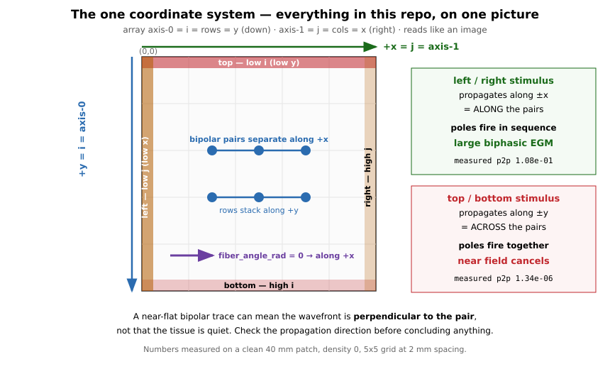
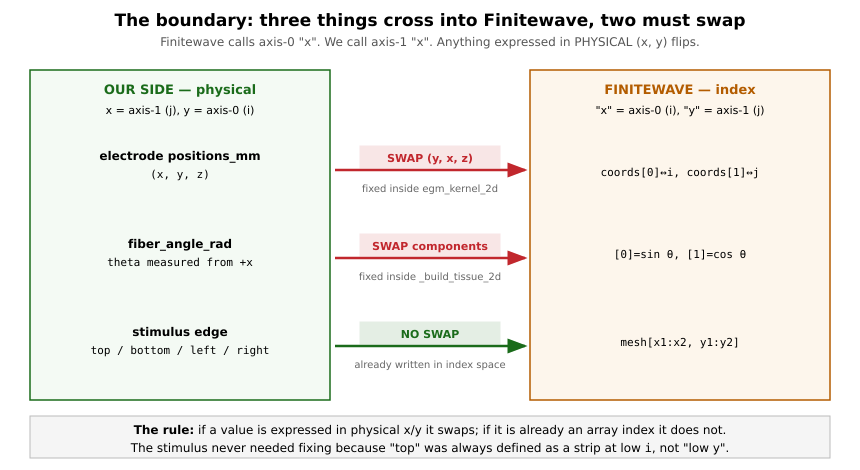

# Simulation theory — what each step does to the signal

This document walks through what happens inside one
``synthegm-generate-dataset`` simulation, what each step represents
physically, and what it does to the signal that eventually lands in the
ClassifierBank. It is meant to be read by a developer who already knows
signal processing but is new to cardiac electrophysiology — every step
links back to the math and to a small number of papers worth reading
deeper.

The reading list at the bottom is annotated. Start with the three
**[anchor]** papers if you only read three.

## The pipeline at a glance

A single simulation goes through ten steps. Five live inside the
backend; five are backend-agnostic and live in the runner / storage
modules. Two things to read first: **the solver runs for longer than the trace
it produces** (*The four lengths*), and **two coordinate systems meet in this
pipeline** (*Coordinate systems*). Both have bitten us.

```
                    one simulation
   ┌──────────────────────────────────────────────────────┐
   │                                                      │
   │  1. Tissue + substrate setup    ┐                    │
   │  2. Activation source           │  inside backend    │
   │  3. AP solver runs              │  (Finitewave)      │
   │  4. Unipolar φ_e captured       │                    │
   │     at electrode positions      ┘                    │
   │  5. Pseudo-EGM theory (math)       (reference)       │
   │  6. Bipolar pairing             ┐                    │
   │  7. Downsample to 1 kHz         │  backend-agnostic  │
   │  7b. Window the activation      │  runner            │
   │  8. Label assignment            │                    │
   │  9. Storage (ClassifierBank)    ┘                    │
   │                                                      │
   └──────────────────────────────────────────────────────┘

   what the classifier eventually sees:
     bipolar EGM trace  (n_pairs, T_samples)  at 1 kHz
     integer label      ∈ {healthy, fibrotic}
```

The figure below shows the same nine steps with the data type at each
hand-off:

```
Patch2DGeometry              ←──────┐
UniformRandomFibrosis        ←──────┤      strategy specs
PlanarEdgeStimulus           ←──────┤      (pure data)
CenteredGrid2D               ←──────┘
        │
        ▼
┌──────────────────────────────────┐
│ FinitewaveBackend                │
│   1. build 2D mesh               │
│   2. apply fibrosis              │
│   3. configure model             │
│      anisotropy + dt             │
│   4. install stimulus            │
│   5. install ECG2DTracker        │
│   6. run AP solver               │
│   7. capture per-electrode       │  φ_e(t, e) at fs_capture (~4 kHz)
│      unipolar φ_e from tracker   │
└──────────────┬───────────────────┘
             │
             ▼
        RawSimulationResult   (unipolar_traces, substrate_mask, ...)
             │
             ▼
┌──────────────────────────────────────┐
│ runner                                │
│   bipolar_from_unipolar(phi_e, pairs)│  → bipolar(t, p)
│   downsample(bipolar, 4kHz, 1kHz)    │  → bipolar(t', p)  at 1 kHz
└──────────────┬───────────────────────┘
               │
               ▼
        SimulationResult           (bipolar_traces, substrate_mask, midpoints, ...)
               │
               ▼
┌──────────────────────────────────┐
│ LabelPolicy.apply(result)         │  → int label per pair
└──────────────┬───────────────────┘
               │
               ▼
        ClassifierBank.h5 (egm-data writer)
```


## The four lengths — and which one each stage sees

Four different durations appear in this pipeline. They were two until cropping
landed, which is why they are easy to run together. Worked example: the shipped
production settings, `trace_duration_ms: 192`, `output_fs_hz: 1000`,
`capture_oversample: 4`, `activation_position: [0.25, 0.75]`, `ap_time_unit_ms:
1.97`.

| # | Length | Where it comes from | Worked value |
|---|---|---|---|
| 1 | **Window / output length `T`** | `run.trace_duration_ms` × `output_fs_hz` | **192 samples** (192 ms) |
| 2 | **Capture duration** | *derived* — how long the solver must run for a `T`-window to fit around the activation | **335 ms** |
| 3 | **Solver time** | capture ÷ `ap_time_unit_ms`, in AP's dimensionless units | **170.05 model units** |
| 4 | **Capture at the capture rate** | capture × (`output_fs_hz` × `capture_oversample`) | **1309 samples** @ 3905 Hz |

Read as a chain, with the array shapes the code actually produces:

```
config: trace_duration_ms = 192 ms          ... this is T, the OUTPUT window
           |
           v   derived: + back-overhang for the crop (+ stimulus delay, if set)
capture_duration_ms = 335 ms
           |
           v   / ap_time_unit_ms
solver runs t_max = 170.05 model units      ... Finitewave's clock
           |
           v   captured at 4 x 1000 Hz
unipolar (1309, n_electrodes)
           |
           v   Step 6: bipolar pairing
bipolar  (1309, 20)                         @ 3905 Hz
           |
           v   Step 7: downsample to 1 kHz
bipolar  (335, 20)   -> transposed to (20, 335)
           |
           v   Step 7b: WINDOW — one T-sample cut per pair, around its
           |             detected activation, at a sampled position p
bipolar  (20, 192)                          ... what lands in the bank
```

**So: the windowing input is the 335-sample downsampled capture, and its output
is the 192-sample trace.** Neither is "the trace duration" in the old sense —
the config value names the *output*, and everything upstream of the window is
sized to make that output cuttable.

**Why the capture is derived rather than configured.** The window has to fit
around an activation whose arrival time the config does not know — it follows
from patch size, conduction velocity, the realized fibrosis draw and the pair's
position, none of which is a number a user types. So the producer derives the
smallest capture that guarantees a fit and runs that. A configured capture set
too short would reject every trace at the crop.

**Without a position policy the picture collapses back to the old one.** No
`activation_position` block means no crop: capture = `trace_duration_ms`, the
trace is the leading `T` samples, and lengths 1 and 2 are the same number
again — which is why the two were conflated for so long without anything
breaking.


## Coordinate systems — read this before anything below

Every geometric quantity in this pipeline lives in one of **two** coordinate
systems, and the pipeline crosses between them three times. Getting one of those
crossings wrong cost two days and produced a bank of near-silent "healthy"
traces that were read as physics for a week. This section exists so that never
happens again.



### The array, and our physical map

The tissue state is a numpy array of shape `(n_i, n_j)`. Our physical
convention maps it **like an image**:

$$
x = j \cdot \mathrm{dr}, \qquad y = i \cdot \mathrm{dr}
$$

| | array | physical | increases toward |
|---|---|---|---|
| **axis-0** | `i` — rows | **y** | the bottom of the picture |
| **axis-1** | `j` — columns | **x** | the right |

Everything on our side follows from those two lines:

- **`geometry.dr_mm`** is millimetres per cell — the only thing converting
  between an index and a distance.
- **Stimulus edges** are named in *index* terms: `top` is a thin strip at low
  `i`, `bottom` at high `i`, `left` at low `j`, `right` at high `j`. So `top` and
  `bottom` bound the **y** extent, `left` and `right` the **x** extent, exactly
  as the names suggest for an image.
- **`CenteredGrid2D`** places `n_rows × n_cols` electrodes and pairs
  *within-row* consecutive ones, so **every bipolar pair separates along +x**,
  and rows stack along +y. Confirmed directly: pair 0's separation vector is
  `(2, 0, 0)` mm at 2 mm spacing.
- **`fiber_angle_rad`** is measured from **+x**, so `0` means fibres along `x`
  (i.e. along `j`) and `π/2` means along `y`.
- **`positions_mm`** columns are `(x, y, z)`, with `z` the electrode standoff
  above the plane rather than a third tissue axis — the mesh is 2D.

### Finitewave's convention is the transpose

Finitewave is internally consistent and **opposite to us**: throughout the
package, *"x" means axis-0*. Verified in its source in three independent places:

| Finitewave code | what it shows |
|---|---|
| `_compute_ecg_2d` | differences `coords[:, 0]` against `i` |
| `compute_weights` | applies `d_xx` — built from `fibers[..., 0]` — to the `(i-1, j)` neighbour |
| `StimVoltageCoord.stimulate` | slices `mesh[x1:x2, y1:y2]` |

So Finitewave's "x" is our "y". Neither convention is wrong; they simply differ,
and the boundary between them is where the bugs live.

### The three crossings, and the rule



> **The rule: a value expressed in physical `x`/`y` must swap. A value that is
> already an array index must not.**

| crossing | physical or index? | action | where |
|---|---|---|---|
| electrode coordinates | physical `(x, y, z)` | **swap** | `egm_kernel_2d` pairs `x` with `j`, `y` with `i` |
| fibre angle | physical, from `+x` | **swap** | `_build_tissue_2d`: `fibers[...,0] = sin θ`, `[...,1] = cos θ` |
| stimulus edge | already an index | **none** | `_build_planar_edge_stimulus_2d` unchanged |

The stimulus needed no fix, and the reason is worth internalising: it was never
written in physical terms. `top` was always *"a strip at low `i`"*, so there was
nothing to translate. **Naming a thing by its index rather than its axis is what
made it immune.**

### What getting it wrong looked like

Both swaps were originally missing, and the failure was not a crash or a subtly
wrong number — it was a plausible-looking result that survived a week of
analysis.

**Electrodes.** Passing `positions_mm / dr` straight through reflected the whole
electrode grid across the diagonal. The mesh, substrate and stimulus were
untouched; only the measurement points moved. Since the pairs separate along
`x`, the transposed grid laid them along `i`, and a `left` stimulus — propagating
along `j` — ran **perpendicular to every pair**. A bipolar trace is a difference
of two nearby unipolar potentials, so its amplitude scales with
$\vec{d}_{AB} \cdot \hat{n}$: perpendicular means both poles sit on the same
wavefront, fire together, and the **near field cancels**.

Measured on a clean 40 mm patch, changing only the stimulus edge:

| stimulus | relative to the pairs | median peak-to-peak |
|---|---|---|
| `left` | along | **1.08e-01** |
| `top` | across | 1.34e-06 |

Five orders of magnitude, from propagation direction alone. Before the fix those
two numbers were the other way round.

The consequence for reading traces, which generalises beyond this bug: **a
near-flat bipolar trace can mean the wavefront is perpendicular to the pair, not
that the tissue is quiet.** An earlier round of analysis read exactly that
signal as "a planar wave over uniform tissue is degenerate" and concluded the
healthy class was physically meaningless — a conclusion that was withdrawn once
the orientation was corrected.

**Fibres.** `fibers[..., 0]` feeds `d_xx`, which acts along axis-0 — our `y`. So
writing `fibers[...,0] = cos(θ)` put `fiber_angle_rad = 0` along `+y` while the
spec docstring and every config comment said `+x`. With `anisotropy_ratio = 3`
the along-fibre direction conducts $\sqrt{3}$ faster, so this did not merely
mislabel an axis — **it put the fast conduction axis 90° from the intended one**,
which then corrupted any conduction-velocity measurement taken along it.

### How this is defended now

Three tests in `tests/test_egm_kernel.py`, each aimed at a different way of
getting it wrong:

- a wave **along** the pairs must beat a wave **across** them by >10×;
- healthy density-0 tissue must produce a real activation, not a cancelled blob;
- a wave along the fibres must clear the mesh sooner than one across them.

Plus an exactness check that our kernel given `(x, y, z)` equals the stock
kernel given `(y, x, z)` — pinning the change as *precisely* a transpose, on a
deliberately non-square mesh so an `i`/`j` mix-up cannot hide behind symmetry.

## Step 1 — Tissue + substrate setup

> **Axis note.** `fiber_angle_rad` is measured from **+x**, but Finitewave
> stores fibre component 0 against axis-0 (our `y`), so `_build_tissue_2d`
> writes `sin θ` into component 0 and `cos θ` into component 1. See
> *Coordinate systems*.

**What the code does.** ``FinitewaveBackend`` reads the
``Patch2DGeometry`` spec (40 mm square at 0.25 mm spacing → 160×160 mesh
cells), builds a ``CardiacTissue2D`` with every interior cell marked
healthy (mesh value ``1``), sets a uniform fiber-orientation field, and
configures the model's diffusion tensor so the realized CV ratio
matches ``spec.anisotropy_ratio``. Then the ``UniformRandomFibrosis``
strategy walks every interior cell: for each cell, draw a uniform[0,1]
sample; mark the cell non-conductive (mesh value ``2``) if
``density > draw``.

**What this represents.** The 2D mesh is a flat patch of atrial wall.
Each cell is a small piece of tissue (0.25 mm × 0.25 mm) that the AP
solver will integrate forward in time. Mesh values are tissue type:

- ``0`` = boundary frame (Finitewave pads the array — these cells are
  not integrated)
- ``1`` = healthy myocardium — full AP cell model runs here, the cell
  is electrically excitable, currents flow into neighbours
- ``2`` = fibrotic, non-conductive — the AP cell model still runs but
  the cell does not transmit current to its neighbours

Anisotropy is the empirical fact that atrial myocardium conducts faster
along the fibre direction than across it. The published
along-to-across CV ratio for human atrium is roughly 2-3:1 (LA: see
[Hansson 1998], [Lemery 2007]). The ratio comes from the structure of
the syncytium: myocytes are elongated, gap junctions cluster at the
ends, so depolarising current spreads more efficiently along the cell's
long axis than across it. We bake this into the diffusion tensor with
``D_along = base · √ratio``, ``D_across = base / √ratio`` (since
$CV \propto \sqrt{D}$).

**What this does to the signal.** Two things, before anything else
happens:

1. **The fibrotic pattern carves "no-go" regions out of the mesh.** When
   a wave hits a fibrotic cell it cannot propagate further through that
   cell — the wave must go around. At low density (<10%) most of the
   wave finds an open path, the wavefront is slightly distorted but
   reaches every healthy region. At moderate density (~30%) the
   wavefront fractures into multiple smaller fronts that meet, collide,
   and create complex morphology. At high density (>60%) propagation
   fails: the wave cannot find a connected path of healthy cells across
   the patch ([Nezlobinsky 2021]).
2. **Anisotropy stretches the wavefront.** A wave moving along the
   fibre direction arrives at the far edge sooner than a wave moving
   across, so a planar stimulus from one edge produces an elongated
   ellipsoidal front rather than a circular one. Bipolar EGMs aligned
   along the fibre direction see sharper, faster activation; bipolars
   across the fibre see slower, broader activation.

The substrate mask itself is also kept around through every later
step. ``LocalDensityLabel`` reads it directly to compute per-pair local
density without re-running the simulation.

**Code:**
- Geometry data: `simulate/specs.py::Patch2DGeometry` (size, dr,
  fiber angle, anisotropy ratio).
- Substrate data: `simulate/specs.py::UniformRandomFibrosis` (density).
- Tissue construction: `backends/finitewave/backend.py::_build_tissue_2d`.
- Anisotropy plumbing: `backends/finitewave/backend.py::_configure_anisotropy_2d`.
- Substrate realisation: `backends/finitewave/backend.py::_apply_substrate_2d`
  → `_apply_uniform_random_fibrosis_2d`.
- Mask snapshot: `backends/finitewave/backend.py::FinitewaveBackend.simulate`
  (the `substrate_mask = tissue.mesh.astype(np.int8, copy=True)` line).

**Read deeper.**
- **[Nezlobinsky 2021]** — Diffuse fibrosis on a 2D patch; the
  density-vs-propagation regime map [anchor].
- **[Mitrea 2009]** — Optical mapping of fibrillation in fibrotic
  hearts. Real physiology to contrast with the idealised square patch.
- **[Hansson 1998]**, **[Lemery 2007]** — Empirical atrial CV
  anisotropy from human electroanatomic mapping; the source of the
  3:1 default.

## Step 2 — Activation source

> **Axis note.** The edge names are defined in *index* terms — `top` is a strip
> at low `i`, `left` at low `j` — which is why they needed no correction when the
> electrode and fibre conventions were fixed. See *Coordinate systems*.

**What the code does.** ``PlanarEdgeStimulus(edge)`` is a thin strip
of voltage applied to a chosen edge of the mesh at ``t=0``. The strip
is three cells thick by default. The CLI samples the edge uniformly
at random per simulation.

**What this represents.** The simplest possible model of a
propagating activation: an instantaneous, line-source pulse that raises
V_m above threshold on one strip of cells. In a real heart an
activation might come from sinus rhythm (from the SAN), from a focal
ectopic source (a small spot), or from re-entry (a self-sustaining
spiral). Phase 1 only models a planar wave from an edge because (a) it
is the simplest source that traverses the patch once cleanly, and (b)
the morphology of the resulting EGM is what we want the classifier to
learn from. Phase 2+ will swap this for ``PointStimulus``,
``PacingTrain``, and re-entry-protocol stimuli.

**What this does to the signal.** Sets the activation direction. A
planar wave from the ``left`` edge arrives at the electrodes from left
to right; a planar wave from the ``top`` edge arrives top to bottom.
Bipolar pairs aligned with the propagation direction see large,
biphasic morphology; pairs perpendicular to propagation see small,
fractionated morphology because both poles are excited near
simultaneously. By randomising the edge per simulation we prevent the
classifier from using activation direction as a shortcut feature —
fibrosis discrimination should generalise across propagation
directions, so we want directionally-balanced training data.

**Code:**
- Activation data: `simulate/specs.py::PlanarEdgeStimulus` (edge,
  voltage, strip thickness, time offset).
- Per-sim random edge sampling:
  `simulate/specs.py::random_edge` (called from
  `simulate/dataset.py::generate_dataset`).
- Stimulus install in the backend:
  `backends/finitewave/backend.py::_install_activation_2d`
  → `_build_planar_edge_stimulus_2d`.

**Read deeper.**
- **[Stewart 1999]** — Source-sink interpretation of why thin strips
  reliably initiate a propagating wave (the strip is wide enough to
  recruit downstream tissue but small enough not to behave like a
  point source).

## Step 3 — AP solver

**What the code does.** Finitewave runs the Aliev-Panfilov model
([Aliev 1996]) on the 160×160 mesh for ``effective_capture_duration_ms /
AP_TIME_UNIT_MS`` model time units, with ``dt = 0.01`` model units per
integration step.

> **This used to read ``trace_duration_ms``, and that is now wrong.** The two
> were the same number until controlled-position cropping (SEP2) arrived: the
> solver ran for exactly as long as the trace it produced. It no longer does —
> a window placed around the activation needs signal either side of it, so the
> solver runs **longer** than the trace. ``trace_duration_ms`` now means *the
> length of the output window*, not the length of the simulation. See
> **The four lengths** below; they are easy to conflate and this doc conflated
> two of them. AP_TIME_UNIT_MS = 1.97 ms is the calibration constant
that maps AP non-dimensional time → physical milliseconds (re-run the
calibration when ``dr`` or the model changes).

**What this represents.** The membrane potential of each cell evolves
in time according to a small system of ODEs (Aliev-Panfilov has two
state variables per cell: V and a recovery variable r), coupled
spatially via the diffusion term. This is the **monodomain**
reaction-diffusion equation:

$$
\frac{\partial V}{\partial t} = \nabla \cdot (D \nabla V) - I_{\text{ion}}(V, r)
$$

$$
\frac{\partial r}{\partial t} = G(V, r)
$$

In words:

- $I_{\text{ion}}$ is the cell model's ionic current — for AP this is
  a phenomenological polynomial that captures the basic excitable
  dynamics (resting → fast upstroke → plateau → recovery) without
  modeling individual ion channels.
- $\nabla \cdot (D \nabla V)$ is the diffusion term that couples
  neighbouring cells — depolarisation of one cell drives current into
  neighbours via gap junctions; we represent gap-junction conductivity
  with the diffusion tensor ``D``.
- For non-conductive cells (mesh ``= 2``) the diffusion term to/from
  that cell is zero — they are electrically isolated.

Phase 1 uses **Aliev-Panfilov** because:

- It is the simplest model that captures the excitable dynamics needed
  for wave propagation + collision behaviour.
- It runs fast on a laptop — a 4 cm patch for 200 ms takes seconds, not
  minutes.
- The pipeline shape (substrate → wave → V_m → EGM) does not depend
  on which cell model is plugged in; we can swap to a richer model
  later without redoing anything downstream.

The richer model for Phase 2 is **Courtemanche 1998**, a human atrial
ionic model with individually-modelled Na/K/Ca channels, gating
variables, and physiologically-tuned APD. It is far more expensive but
produces morphology that matches recorded atrial EGMs more faithfully.

**What this does to the signal.** Generates ``V_m(t, i, j)`` — a movie
of the transmembrane potential field across the patch. This is the
upstream signal that the pseudo-EGM step will project onto electrode
coordinates. Two things to notice about the V_m field:

1. **Each cell's V_m trace looks like a depolarisation-plateau-recovery
   sequence.** The fast upstroke of V_m at a cell happens when the
   activation wave arrives at that cell; the timing of the upstroke is
   the cell's local activation time. Bipolar EGM morphology is
   essentially the spatial derivative of the V_m field, captured by
   the pseudo-EGM forward calc — which is why the *timing* of the wave
   arriving at the two poles of a bipolar pair is what produces the
   sharp biphasic deflection.
2. **Fibrosis distorts the V_m field locally.** Near a fibrotic
   cluster, the wave has to go around. The arrival time at the
   downstream side of the cluster is delayed, the V_m field on either
   side of the cluster has visible asymmetry, and a bipolar pair
   straddling the cluster sees a fractionated waveform with multiple
   small deflections instead of one clean biphasic spike.

**Code:**
- Model construction + run:
  `backends/finitewave/backend.py::FinitewaveBackend.simulate`
  (steps 2-3 inside that method: `fw.AlievPanfilov2D()`,
  `model.t_max = ...`, `model.run()`).
- Per-run knobs:
  `backends/__init__.py::RunConfig` (trace duration, output rate,
  AP calibration constant, oversampling factor).
- AP solver internals: `finitewave.AlievPanfilov2D` (external lib).

**Read deeper.**
- **[Aliev 1996]** — The original Aliev-Panfilov phenomenological
  model [anchor].
- **[Courtemanche 1998]** — Human atrial ionic model; the
  Phase-2 substitute.
- **[Loewe 2014]** — AF-remodeled Courtemanche for the Phase-4
  rhythm work.
- **[Clayton 2011]** — A textbook-level review of computational
  electrophysiology models; useful to compare phenomenological vs
  ionic models.

## Step 4 — V_m → φ_e capture at electrode positions

> **Axis note.** This is where electrode coordinates cross into Finitewave, and
> where they were transposed for the whole of Wave 1. Our `(x, y, z)` pairs `x`
> with `j` and `y` with `i`; Finitewave's kernel pairs column 0 with `i`. See
> *Coordinate systems* for what that cost and how it is defended now.

**What the code does.** Finitewave's ``ECG2DTracker`` is instantiated
with the ``ElectrodePlacement``'s electrode coordinates (in mesh-index
units, ``coord_grid = coord_mm / dr_mm``). As the AP solver runs, the
tracker computes per-electrode unipolar pseudo-EGMs every
``tracker.step`` integration steps. The effective capture rate is
chosen so it's ~4× the output rate — i.e. ~4 kHz when the output bank
is at 1 kHz.

**What this represents.** Where the AP solver gives us the V_m field
on the mesh, what an electrode actually senses is the extracellular
potential φ_e at the electrode's position. Going from V_m (defined on
every mesh cell) to φ_e (defined at a few electrode positions) is the
**pseudo-EGM forward calculation** — the math is explained in detail
in Step 5 below.

For Finitewave-based simulations this step happens **inside the
backend**: ``ECG2DTracker`` implements the same Okenov/Plonsey formula
our :func:`compute_phi_e` does, but does it in C-extension code while
the solver is running, so it's both faster and cheaper than capturing
the full V_m field + running our own forward calc afterwards. The
backend returns per-electrode unipolar traces; ``compute_phi_e``
remains a public helper for *other* backends (TorchCor, openCARP) that
don't ship native pseudo-EGM.

**What this does to the signal.** Projects V_m (intracellular,
defined everywhere on the mesh) onto φ_e (extracellular, defined at
each electrode position). Time-discretises that projection at ~4 kHz so
the downstream downsampling step (#7) can use a clean integer-stride
decimation. The per-electrode unipolar trace at this point is what an
ideal point electrode would record at the chosen ``(x, y, z)``
position.

**Code:**
- Tracker install:
  `backends/finitewave/backend.py::FinitewaveBackend.simulate`
  (the `fw.ECG2DTracker(measure_coords=coords_grid)` block).
- Capture-rate selection:
  `backends/finitewave/backend.py::_pick_capture_step` (picks the
  integration-step stride so the achieved capture rate ≈
  `oversample × output_fs_hz`).
- Trace extraction at end of run:
  `backends/finitewave/backend.py::FinitewaveBackend.simulate`
  (the `unipolar = np.asarray(ecg_tracker.output, ...)` line).
- Electrode coords: `simulate/specs.py::CenteredGrid2D.sample` +
  `positions_mm` field.

**Read deeper.**
- **[Finitewave docs / source]** — Specifically ``ECG2DTracker``. The
  tracker takes ``measure_coords`` (electrode positions in mesh-index
  units) and a ``step`` attribute (how many integration steps between
  captures). Output is ``(T_capture, n_electrodes)``, ready to feed
  into bipolar pair subtraction.
- **[Okenov 2024]** supplement S2 — the formula the tracker is
  implementing.

## Step 5 — The pseudo-EGM forward calculation (theory)

**What the formula is.** The pseudo-EGM forward calculation is the
Plonsey/Barr extracellular-potential integral applied to a 2D mesh.
For each electrode at position $\vec r_e$, the unipolar
potential is

$$
\phi_e(\vec r_e, t) \;\propto\; \sum_{i, j \in \text{interior}}
                                 \frac{(D \nabla^2 V_m)_{i,j,t}}{r_{e, i, j}}
$$

where $r_{e, i, j}$ is the 3D Euclidean distance from electrode
$e$ to mesh node $(i, j)$ (with the electrode at height $z = h$
above the patch). Finitewave does this inside ``ECG2DTracker`` while
the AP solver runs (Step 4). Our `compute_phi_e` helper
implements the same formula in pure numpy for backends that don't ship
a tracker.

**Code:**
- Backend-agnostic helper:
  `simulate/pseudo_egm.py::compute_phi_e` (pure numpy, used by future
  backends without native pseudo-EGM; not called for Finitewave
  because ECG2DTracker already does the same math in C).
- Per-electrode trace consumption:
  `simulate/runner.py::run_single` (consumes
  `RawSimulationResult.unipolar_traces` regardless of which backend
  produced it).

**What this represents — the pseudo-bidomain approximation.**
The full **bidomain** model represents the heart as two co-located
continua — intracellular (where V_m lives) and extracellular (where
φ_e lives, and where the electrodes actually sense). The two are
coupled by the conductivity tensors of each domain.

A monodomain solver like Finitewave only integrates the intracellular
domain — it gives you V_m, not φ_e. To go from V_m to φ_e you either
solve a full bidomain problem (expensive) or use the **pseudo-bidomain
approximation** ([Plonsey 1969], [Plonsey 1988]): treat the
extracellular domain as an infinite, homogeneous, isotropic volume
conductor. Then the extracellular potential at any point ``r_e`` is the
solid-angle integral of the transmembrane current source ``I_m`` from
the intracellular domain:

$$
\phi_e(\vec r_e, t) = \frac{1}{4\pi \sigma_e}
                       \int \frac{I_m(\vec r, t)}{|\vec r_e - \vec r|} \, dV
$$

For us:

- The integral becomes a sum over mesh cells (we work on a discrete
  mesh).
- ``I_m`` is approximated by the discrete Laplacian of V_m (the
  diffusion step's change in V_m at each cell is the discrete
  equivalent of $D \nabla^2 V_m$). Finitewave's own tracker forms the
  same source term, and we take it straight from the solver's diffusion
  increment rather than recomputing a stencil.
- The ``1 / (4π σ_e)`` normalisation **is** applied (σ_e = 1 by
  default). It is a constant scale, so it changes no morphology and no
  classification, but keeping it makes our output directly comparable
  with anything else computing a pseudo-EGM. This reverses an earlier
  decision to drop it — the saving was nil and the incomparability was
  a real cost during the CV investigation.

> **The weighting is ``1 / r``, and getting there took a fix.**
> The exponent is not free: it is *determined* by which of two
> equivalent formulations you sum. Integrating by parts moves the
> derivative from V_m onto the kernel, so
>
> $$
> \int \frac{\nabla \cdot (D \nabla V_m)}{r} \, dV
>   \;=\; -\int D \nabla V_m \cdot \nabla \frac{1}{r} \, dV
>   \;=\; \int D \nabla V_m \cdot \frac{\hat r}{r^2} \, dV
> $$
>
> **Laplacian source ⇒ ``1/r``. Gradient source ⇒ ``1/r²``.** openCARP
> takes the gradient route and so uses ``1/r²`` correctly. We take the
> Laplacian route, so ``1/r`` is ours.
>
> Finitewave 0.9.3 mixed them: a Laplacian source term divided by the
> **squared** grid distance, with no ``sqrt`` anywhere. We shipped that
> until S40. Upstream has since fixed it the same way on their
> unreleased ``solvers`` branch. Our kernel now takes the ``sqrt``; the
> ``distance_power`` argument exists only to reproduce pre-fix banks for
> comparison and is deliberately not a config field.
>
> Full derivation, the cross-simulator survey, and the figures:
> ``intracardiac-platform/project/investigations/pseudo_egm_axes_and_weighting.md``.

The Okenov 2024 paper applies exactly this forward calc on a similar
2D Finitewave-driven fibrosis substrate, then trains a CNN on the
resulting EGMs. Their formulation lives in the supplement, equation
S2.

**What this does to the signal.** Converts V_m (intracellular,
defined everywhere on the mesh) into φ_e (extracellular, defined at
electrode positions). Three properties of φ_e to keep in mind:

1. **φ_e is dominated by the cells closest to the electrode.** The
   ``1 / r`` kernel falls off with distance, so a 0.5 mm-high electrode
   primarily sees the ``I_m`` of the dozen-ish cells directly under
   it. This is exactly the receptive-field issue that motivates
   ``LocalDensityLabel`` — a bipolar pair "sees" only a small
   neighbourhood, so its label should be set by that neighbourhood, not
   by the global density.
   Note the falloff is *gentler* than the ``1/r²`` we shipped before
   S40, so each electrode's effective neighbourhood is now slightly
   **wider**, not narrower. In practice the change was small — waveform
   correlation 0.961 against the old output on clean tissue — because
   the nearest sources dominated under either exponent. The far-field
   contamination seen during the CV investigation is a
   *launch-transient* problem, not a weighting problem, and is not
   addressed by this change.
2. **φ_e tracks the rate of change of V_m, not V_m itself.** The
   Laplacian kernel ensures φ_e responds to the *moving wavefront*
   rather than to a static depolarised region. This is why an EGM
   shows a brief spike at activation rather than a slow plateau.
3. **The electrode height matters a lot.** A 1 mm-high electrode sees
   a much broader (and smaller-amplitude) signal than a 0.2 mm-high
   electrode does. By sampling height uniformly in [0.2, 1.0] mm we
   produce a realistic distribution of contact quality across the
   training set.

**Read deeper.**
- **[Okenov 2024]** — Same forward formulation we use; trains a CNN
  to classify atrial fibrosis from simulated bipolar EGMs [anchor].
- **[Plonsey 1969]** — Foundational paper on the extracellular
  potential formulation; the volume-conductor integral that underlies
  the pseudo-bidomain approximation.
- **[Plonsey 1988]** — Specifically on the pseudo-bidomain
  approximation and when it's valid.
- **[Henriquez 1993]** — A clear and accessible derivation of the
  full bidomain equations; read this before reading Plonsey if the
  notation is unfamiliar.

## Step 6 — Bipolar pairing

> **Axis note.** `CenteredGrid2D` separates each pair along **+x**, so bipolar
> amplitude depends on whether the wavefront travels along `x` (large biphasic)
> or along `y` (near-cancelled). A flat trace is not evidence of quiet tissue.
> See *Coordinate systems*.

**What the code does.** ``pseudo_egm.bipolar_from_unipolar(phi_e,
pairs)`` differences the unipolar φ_e traces between the two
electrodes of each pair: ``bipolar(t, p) = φ_e(t, a_p) - φ_e(t, b_p)``.

**What this represents.** Clinically, an EP catheter records bipolar
EGMs to suppress far-field signals (atrial activations recorded on a
ventricular catheter, distant chamber activity, etc.). The bipolar
subtraction is essentially a spatial high-pass filter — sources far
from the pair contribute roughly the same amount to both poles and
cancel in the difference; sources between the poles contribute
oppositely-signed to each pole and add to the difference.

**What this does to the signal.** Three effects:

1. **Suppresses far-field common-mode signal.** Activity at distant
   parts of the patch (say, a wavefront still propagating in the
   opposite corner) shows up equally at both poles of a small bipolar
   pair, so the difference is roughly zero. Local activation between
   the poles shows up oppositely on each, so the difference is large.
2. **Sharpens the timing of the activation deflection.** A unipolar
   φ_e at one electrode has a broad asymmetric morphology; the
   difference of two adjacent unipolars produces the characteristic
   biphasic sharp-peak-sharp-trough shape that EP physicians look for.
3. **Sensitive to wavefront orientation.** A wavefront parallel to the
   pair (both poles activated simultaneously) produces minimal
   bipolar signal; a wavefront perpendicular to the pair produces
   maximal signal. This is part of why we have 5 bipolar pairs per
   row — different pairs are at different orientations relative to
   the wave, so the classifier sees morphology across orientations.

**Code:**
- Pair definition: `simulate/specs.py::CenteredGrid2D.bipolar_pairs`
  (tuple of (a, b) electrode index pairs, within-row consecutive).
- Subtraction: `simulate/pseudo_egm.py::bipolar_from_unipolar`,
  called from `simulate/runner.py::run_single`.

**Read deeper.**
- **[Stevenson 2005]** — Practical introduction to EP signal
  interpretation; explains why bipolar > unipolar for local activation
  timing.

## Step 7 — Downsampling

**What the code does.** ``pseudo_egm.downsample(bipolar, source_fs_hz,
target_fs_hz)`` resamples each bipolar trace from the capture rate
(~4 kHz) to the output rate (1 kHz). Integer-stride fast path when
the ratio is exact; linear-interpolation slow path otherwise.

**What this represents.** Match the output rate to IAFDB (1 kHz) so
synthetic and real bipolar EGMs are length-comparable for the mixer
and the classifier. The synthetic side runs at higher rates internally
because the AP integration is most stable at small ``dt``; output at
1 kHz is plenty for bipolar EGM bandwidth (clinical bandpass for
bipolar atrial EGM is typically 30-300 Hz, so 1 kHz output respects
Nyquist by ~3×).

**What this does to the signal.** Reduces sample count without
distorting the morphology. We omit an anti-alias filter at this step
(Phase 1) because:

- AP membrane dynamics have minimal energy above a few hundred Hz.
- The source rate is 4× the target.

For Phase 2 / Courtemanche (faster wavefronts, sharper activation
deflections), we will swap the linear interpolation for
``scipy.signal.resample_poly`` with a proper polyphase filter; the
existing function-signature stays the same.

**Code:**
- Resample function: `simulate/pseudo_egm.py::downsample` (integer
  stride + linear-interp fallback), called from
  `simulate/runner.py::run_single` immediately after
  `bipolar_from_unipolar`.
- Exact-T pinning: `simulate/runner.py::run_single` (the
  truncate/pad block after the downsample, so every trace in a
  dataset shares T).

## Step 7b — Windowing (controlled-position crop)

**What the code does.** ``simulate/cropping.py`` cuts one ``T``-sample window
per bipolar trace out of the downsampled capture, placing that pair's
**detected** activation at a fractional position ``p`` drawn per window from
egm-signal's ``UniformPositionGenerator``. Skipped entirely when the config has
no ``activation_position`` block, in which case the trace is the leading ``T``
samples of the capture.

**Per trace, not per simulation.** The wavefront sweeps the electrode grid, so
pairs either side of it activate tens of milliseconds apart. One offset applied
to a whole simulation would hit the requested position for a single pair and
leave it uncontrolled for the rest.

**Detected, not told.** The stimulus time is configured, but the activation time
*at a given pair* is not — the stored trace is a pseudo-EGM whose timing follows
the wavefront's arrival, a function of conduction velocity, the realized
fibrosis draw, the electrode standoff and the pair's position. Detecting also
keeps the sim-to-real comparison honest: the real corpus offers nothing but the
electrogram, so handing the synthetic side a privileged ground-truth time would
flatter the comparison the experiment exists to make.

**Same path as IAFDB.** The windower is egm-signal's
``SingleActivationWindower``, which is ``window_train`` with a **train of one** —
the same function the real corpus goes through. The single-versus-multi
activation difference is the only intended divergence in framing between the two
corpora.

## Step 8 — Label assignment

**What the code does.** ``LabelPolicy.apply(simulation_result)`` is
called once per simulation. ``GlobalDensityLabel`` reads the realised
fibrosis density from the substrate metadata and labels every
bipolar pair in the simulation the same way. ``LocalDensityLabel``
walks each bipolar pair, samples the substrate mask in a circle of
radius ``radius_mm`` around the pair's midpoint, counts fibrotic vs
healthy interior cells, and labels each pair independently.

**What this represents.** The ground-truth label the classifier learns
to predict. The two policies represent two different research
questions:

- **GlobalDensityLabel** asks "Is the *whole patch* fibrotic?" Useful
  if your downstream clinical question is dichotomising patients into
  healthy vs. diffuse-fibrosis (e.g. for ablation triage).
- **LocalDensityLabel** asks "Is the *bipolar pair's neighbourhood*
  fibrotic?" Useful if your downstream clinical question is identifying
  which mapping points sit over scar tissue (e.g. for targeted
  ablation site selection — the original portfolio project goal).

The receptive-field mismatch in ``GlobalDensityLabel`` is the failure
mode we hit on the v1 training run: at low global density (~10%) a
bipolar pair's signal is dominated by what's within a few mm of the
pair, not by the whole-patch density. Traces from a low-density sim
with no fibrosis near the pair look healthy but are labeled fibrotic
under GlobalDensityLabel. ``LocalDensityLabel`` resolves this by
labelling each pair from its own neighbourhood.

**What this does to the signal.** Nothing — labels are metadata, not
modifications to the signal. They land in the ClassifierBank
alongside the trace.

**Code:**
- Protocol + concretes: `simulate/label_policy.py::LabelPolicy`,
  `GlobalDensityLabel`, `LocalDensityLabel`.
- Application loop:
  `simulate/dataset.py::generate_dataset` (calls
  `config.label_policy.apply(result)` per sim, accumulates flat
  labels + asserts label-dict consistency).

**Read deeper.**
- **[Marchlinski 2000]**, **[Sanders 2003]** — The clinical voltage
  thresholds used for ablation site selection; these define the
  ground-truth criteria that a clinician would use to decide "this
  electrode is over scar".

## Step 9 — Storage

**What the code does.** ``simulate/storage.py`` collects all
``SimulationResult`` instances + ``LabelPolicy.apply()`` outputs across
the N simulations, builds a Pydantic ``ClassifierBank`` model from
egm-contracts, and calls ``myocard_egm_data.banks.write_classifier_bank``.
It also always writes the ``synthetic_bank`` 2.0 sibling, which carries
the per-simulation generation config and the theta-spec.

**What this represents.** The producer's contract with downstream
consumers, split by purpose. **ClassifierBank** is the unified,
labelled, classifier-ready format egm-classifier and egm-studio agree
on — deliberately *source-agnostic*, so it carries the signal, the
label and the join keys, and nothing about how the signal was
generated. **`synthetic_bank` 2.0** carries that generation config,
per simulation, plus the theta-spec; egm-studio's realism and
parameter-estimation views read it. The two are parallel artifacts
joined on ``simulation_id``, not one derived from the other.

**What this does to the signal.** Nothing material — float32 traces
land in HDF5 alongside metadata. The schema-versioned writer makes the
file self-describing, so a consumer at the same egm-contracts pin can
validate the file on read.

**Code:**
- Default ClassifierBank writer:
  `simulate/storage.py::write_classifier_bank_from_dataset` (builds
  ClassifierBankMetaData + per-trace ClassifierTrace list, hands to
  `myocard_egm_data.banks.write_classifier_bank`).
- `synthetic_bank` 2.0 writer:
  `simulate/storage.py::write_synthetic_bank_from_dataset` (builds the
  per-simulation config group + the collapsed `traces/` group + the
  theta-spec, hands to `myocard_egm_data.banks.write_synthetic_bank`).
  The **same** writer serves the noise-mixed case: the inline mixer path
  passes the mixed signals plus the three per-trace noise columns, since
  2.0's per-simulation config cannot be rebuilt from a mixed
  ClassifierBank.

## What the classifier eventually sees

After nine steps, a single training example looks like:

| Field | Type | Where it came from |
|---|---|---|
| ``signal`` | ``(T_samples,)`` float32 at 1 kHz | bipolar pair from one electrode row of one simulation |
| ``label_truth`` | int (0 = healthy, 1 = fibrotic) | LabelPolicy.apply() |
| ``trace_metadata.simulation_id`` | int | which simulation produced this trace — and the join key into the ``synthetic_bank``'s per-simulation config |
| ``trace_metadata.pair_index`` | int | which bipolar pair within that simulation |
| ``trace_metadata.patient_id`` | str | ``= simulation_id``; one simulation is one "patient" for the split |

The generation parameters that used to sit here — density, electrode
row and height, stimulus edge — are on the ``synthetic_bank``, once per
simulation, reachable through ``simulation_id``.

With ~100 simulations × 20 bipolar pairs = ~2000 traces, sampled
across density, edge, electrode height. The classifier sees the
bipolar morphology; the metadata supports analysis but is not part of
the model input.

## Annotated reading list

The three **[anchor]** papers are the highest leverage if you only
read three. Group them as: physics, formulation, downstream
classification.

**Physics**
- **[Aliev 1996]** — Aliev R, Panfilov AV. *A simple two-variable
  model of cardiac excitation.* Chaos Solitons Fractals. The
  Aliev-Panfilov phenomenological cell model — Phase 1's cell model
  [anchor].
- **[Courtemanche 1998]** — Courtemanche M, Ramirez RJ, Nattel S.
  *Ionic mechanisms underlying human atrial action potential
  properties.* Am J Physiol. The human atrial ionic model — Phase 2's
  cell model.
- **[Clayton 2011]** — Clayton RH, Bernus O, Cherry EM, et al.
  *Models of cardiac tissue electrophysiology: progress, challenges,
  and open questions.* Prog Biophys Mol Biol. A textbook-level review
  comparing phenomenological vs ionic models, monodomain vs bidomain,
  fitted vs first-principles parameterisation.
- **[Loewe 2014]** — Loewe A, Wilhelms M, Schmid J, et al. *Parameter
  estimation of ionic models for human atrial myocytes.* Comput
  Cardiol. AF-remodelled Courtemanche; useful for Phase 4.

**Forward formulation (V_m → φ_e)**
- **[Plonsey 1969]** — Plonsey R. *Bioelectric phenomena.* The
  textbook treatment of extracellular potentials from intracellular
  current sources.
- **[Plonsey 1988]** — Plonsey R, Barr RC. *Bioelectricity: A
  quantitative approach.* The textbook on the pseudo-bidomain
  approximation; chapter on volume-conductor integrals.
- **[Henriquez 1993]** — Henriquez CS. *Simulating the electrical
  behavior of cardiac tissue using the bidomain model.* Crit Rev
  Biomed Eng. Clean derivation of the bidomain equations.
- **[Okenov 2024]** — Okenov AO, Nezlobinsky T, Vandersickel N,
  Panfilov AV. *Atrial fibrosis identification with bipolar
  electrograms using a deep learning approach.* PLOS ONE. Most
  directly analogous prior work: same backend (Finitewave), same
  fibrosis substrate, same pseudo-EGM forward calc, CNN classifier
  [anchor]. Supplement S2 has the explicit formula.

**Substrate + propagation**
- **[Nezlobinsky 2021]** — Nezlobinsky T, Solovyova O, Panfilov AV.
  *Anisotropy of conduction velocity in atrial fibrosis: implications
  for tissue heterogeneity assessment.* Front Physiol. The
  density-vs-propagation regime map for diffuse atrial fibrosis on a
  2D patch [anchor].
- **[Mitrea 2009]** — Mitrea BG, Caldwell BJ, Pertsov AM. *Imaging
  electrical excitation inside the myocardial wall.* Biomed Eng
  Online. Optical mapping of fibrillation in fibrotic hearts — real
  physiology to compare against the idealised square patch.
- **[Hansson 1998]** — Hansson A, et al. *Right atrial free wall
  conduction velocity and degree of anisotropy in patients with
  stable sinus rhythm studied during open heart surgery.* Eur Heart
  J. The empirical atrial CV anisotropy that informs our default
  3:1 ratio.
- **[Lemery 2007]** — Lemery R, Birnie D, Tang ASL, et al. *Normal
  atrial activation and voltage during sinus rhythm in the human
  heart: an endocardial and epicardial mapping study in patients with
  a history of atrial fibrillation.* J Cardiovasc Electrophysiol.
  Empirical baseline atrial activation maps.

**Bipolar EGM interpretation + clinical anchors**
- **[Stevenson 2005]** — Stevenson WG, Soejima K. *Recording
  techniques for clinical electrophysiology.* J Cardiovasc
  Electrophysiol. Why bipolar over unipolar for activation timing.
- **[Marchlinski 2000]** — Marchlinski FE, Callans DJ, Gottlieb CD,
  Zado E. *Linear ablation lesions for control of unmappable
  ventricular tachycardia in patients with ischemic and nonischemic
  cardiomyopathy.* Circulation. The original < 0.5 mV bipolar
  threshold for scar.
- **[Sanders 2003]** — Sanders P, Morton JB, Kistler PM, et al.
  *Electrophysiological and electroanatomic characterization of the
  atria in patients with atrial flutter.* Circulation. Atrial-specific
  voltage thresholds (the "electrically silent" tier at < 0.05 mV).

**Synthetic-side ML precedent**
- **[Sánchez 2021]** — Sánchez J, et al. *Influence of left atrial
  ostial regions on the morphology of the left atrial appendage
  during atrial fibrillation: A computational and electroanatomic
  mapping study.* Front Physiol. Synthetic + real mixing for atrial
  EGM classification; the methodological ancestor of this pipeline.
- **[Stewart 1999]** — Stewart MS. *Source-sink mismatch and
  termination of conducted action potentials.* Numerical study of
  why thin-strip stimulation reliably initiates a propagating wave.

## Capture sizing for controlled-position cropping — the equations

The goal is to window a synthetic trace the way an IAFDB trace is windowed. A
real record is arbitrarily long with activations somewhere in the middle, so a
window at any position has material either side of it. A simulation has to be
*arranged* to have that property, using two knobs: fire the stimulus late enough
that signal exists before the activation, and run long enough that signal exists
after it. Everything below is that arrangement, made explicit.

### Symbols

All in samples at $f_s$ = `output_fs_hz`, unless suffixed ms.

| symbol | meaning | source |
|---|---|---|
| $T$ | window length = on-disk trace length | `trace_duration_ms` $\times f_s$ |
| $p$ | fractional activation position, $p \in [p_{lo}, p_{hi}] \subseteq [0,1]$ | `activation_position` |
| $k(p)$ | offset from window start to the activation | derived |
| $a$ | activation index within the capture | **measured**, per pair |
| $D$ | stimulus delay | derived or configured |
| $V$ | travel allowance | assumed |
| $N$ | capture length | derived |

### Window placement

The window puts the activation $k(p)$ samples in from its start:

$$
k(p) = \operatorname{round}\bigl(p \, (T-1)\bigr)
$$

so around an activation at index $a$ it spans

$$
\bigl[\, a - k(p),\; a - k(p) + T \,\bigr)
$$

and it fits the capture exactly when both hold:

$$
\underbrace{a - k(p) \;\ge\; 0}_{\text{front}}
\qquad\text{and}\qquad
\underbrace{a - k(p) + T \;\le\; N}_{\text{back}}
$$

### The activation index is not free

$a$ is not a configured value — it is where the wavefront reaches that pair,
which depends on conduction velocity, the realized fibrosis draw, the electrode
standoff and the pair's position. What *is* controllable is that it decomposes:

$$
a \;=\; D \;+\; t_{\text{travel}}, \qquad t_{\text{travel}} \ge 0
$$

Both constraints are then satisfiable without knowing $t_{\text{travel}}$.

### Front — bought with the delay

The worst case is the largest position, since the further back in its window the
activation sits, the more signal is needed ahead of it. Because
$t_{\text{travel}} \ge 0$,

$$
D \;\ge\; k(p_{hi})
\quad\Longrightarrow\quad
a \;\ge\; k(p) \;\; \forall\, p \le p_{hi}
$$

so the producer takes the smallest sufficient delay:

$$
\boxed{\,D = k(p_{hi}) = \operatorname{round}\bigl(p_{hi}(T-1)\bigr)\,}
$$

This holds for **any** patch size, conduction velocity or electrode placement —
no geometry term appears. That robustness is deliberate: CV is being
recalibrated, and a front guarantee that depended on it would have to be
re-derived afterwards.

### Back — bought with capture length

The worst case here is the *smallest* position with the *largest* $a$. Bounding
$t_{\text{travel}} \le V$ gives $a \le D + V$, and substituting into the back
constraint:

$$
N \;\ge\; (D + V) - k(p_{lo}) + T
$$

so the producer takes:

$$
\boxed{\,N = D + V + T - k(p_{lo})\,}
$$

### The travel allowance $V$

$t_{\text{travel}} = d / \mathrm{CV}$ for a stimulus-to-pair distance $d$.
Neither term is available at config time: the config carries no
stimulus-to-pair distance, and CV is an *output* of calibration rather than an
input. So $V$ is **assumed, not derived**:

$$
V = T
$$

At the production 40 mm patch the furthest pair sits ~24 mm from the stimulus
edge, which $T = 192$ covers for any CV above ~0.13 mm/ms — comfortably below
both the present (~0.20) and the target (~0.60) values. An over-estimate costs
solver time; an under-estimate costs traces, so this errs long, and a geometry
that exceeds it raises at the crop with the knob named rather than silently
yielding a short trace.

### Worked example — the shipped settings

$T = 192$, $p \in [0.4, 0.6]$ (matching iafdb-pipeline), $f_s = 1000$ Hz:

$$
D = \operatorname{round}(0.6 \times 191) = 115 \text{ samples}
$$

$$
k(p_{lo}) = \operatorname{round}(0.4 \times 191) = 76
$$

$$
N = 115 + 192 + 192 - 76 = 423 \text{ samples} = 423 \text{ ms}
$$

Then the solver clock, at `ap_time_unit_ms` = 1.97:

$$
t_{\max} = \frac{N_{\text{ms}}}{\texttt{ap\_time\_unit\_ms}} = \frac{423}{1.97} = 214.7 \text{ model units}
$$

Sanity check on the extremes. The activation lands somewhere in
$a \in [115,\, 307]$:

- earliest ($a = 115$), latest position ($p = 0.6$): window starts at
  $115 - 115 = 0$ — flush against the front, nothing spare;
- latest ($a = 307$), earliest position ($p = 0.4$): window ends at
  $307 - 76 + 192 = 423$ — flush against the back, nothing spare.

Both bounds are tight, which is the point: the capture is the smallest one that
cannot fail.

### Without a position policy

No `activation_position` block means no crop. Then $D = 0$, $N = T$, the trace is
the leading $T$ samples of the capture, and the solver runs for exactly
`trace_duration_ms` — the behaviour that predates cropping, and the reason the
capture and the trace were one number for so long.

### Why not zero-padding

A capture that comes up short raises rather than padding. Zeros are perfectly
flat and always at the tail, so a padded trace carries a positional regularity a
classifier can key on — precisely the shortcut that varying $p$ exists to
remove. Under correct sizing the case is unreachable; if it fires, the sizing is
wrong and manufacturing data would hide that.

Implementation: `simulate/sizing.py`. The offset conversion $k(p)$ is restated
there rather than imported so it matches egm-signal's crop exactly — a
one-sample disagreement is a window that fits in theory and not in practice.
